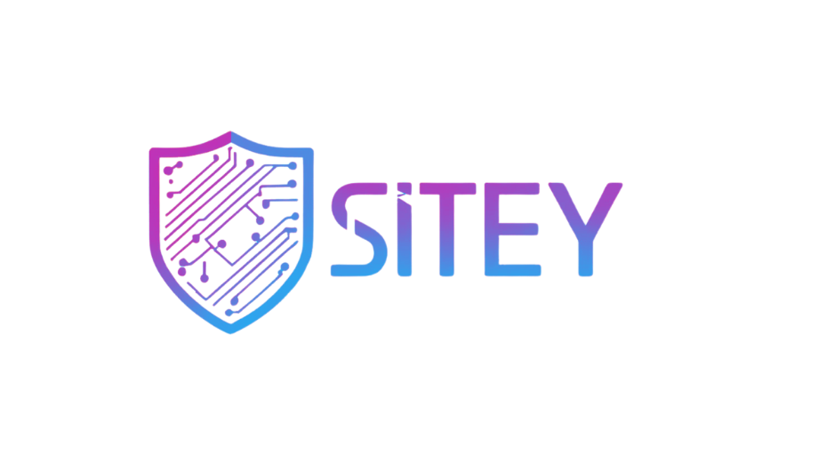

<p align="center">
  
</p>

<h1 align="center">SITEY-VM Zafiyet Yonetim Platformu</h1>

<p align="center">
  <strong>Demo Surumu</strong>
  <br>
  Ag ve web uygulamalariniz icin merkezi zafiyet yonetimi
</p>

<p align="center">
  <a href="https://github.com/pcx1997/sitey-vm-demo/actions"></a>
  <a href="https://github.com/pcx1997/sitey-vm-demo/releases"></a>
  
  
</p>

---

## Hakkinda

SITEY-VM, kurumlarin ag altyapisi ve web uygulamalarindaki guvenlik acikliklarin merkezi olarak yonetmesini saglayan bir zafiyet yonetim platformudur. OpenVAS tarama araciyla entegre calisir.

Bu depo, platformun ucretsiz demo surumunu icerir.

---

## Demo Ozellikleri

| Ozellik | Durum |
|---------|-------|
| Dashboard - Zafiyet gosterge paneli | Mevcut |
| Zafiyet listesi ve detay sayfasi | Mevcut |
| Manuel zafiyet ekleme ve duzenleme | Mevcut |
| PDF / Excel rapor olusturma | Mevcut |
| OpenVAS tarama entegrasyonu | Mevcut |
| Tek kullanici (sifre degistirme) | Mevcut |
| Coklu kullanici ve rol yonetimi | Kurumsal |
| LDAP / Active Directory entegrasyonu | Kurumsal |
| Zamanlanmis taramalar | Kurumsal |
| SLA takibi ve bildirimler | Kurumsal |
| API erisimi | Kurumsal |

---

## Kurulum

### Windows (Onerilen)

[Releases](https://github.com/pcx1997/sitey-vm-demo/releases) sayfasindan en son `SiteyVM_Setup.exe` dosyasini indirin.

1. `SiteyVM_Setup.exe` dosyasini cift tiklayin
2. Kurulum sihirbazini takip edin (Ileri > Ileri > Tamamla)
3. Yonetici sifrenizi belirleyin
4. Uygulama otomatik baslar ve tarayici acilir

Kurulum sonrasi uygulama sistem tepsisinde (sag alt) calisir.

### Linux

```
chmod +x install.sh
./install.sh
./start.sh
```

Tarayicida acin: `http://localhost:5000`

---

## Kurumsal Surum

Tam ozellikli kurumsal surum icin:

| | |
|---|---|
| Web | https://siteyvm.com |
| E-posta | satis@siteyvm.com |

---

<p align="center">
  
  <br>
  <sub>SITEY-VM - Zafiyet Yonetim Platformu</sub>
</p>
